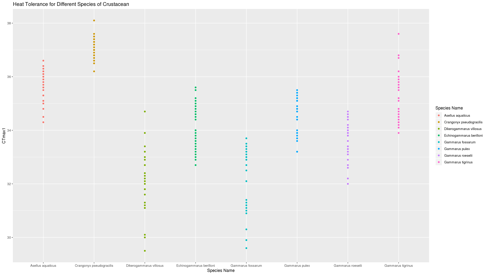
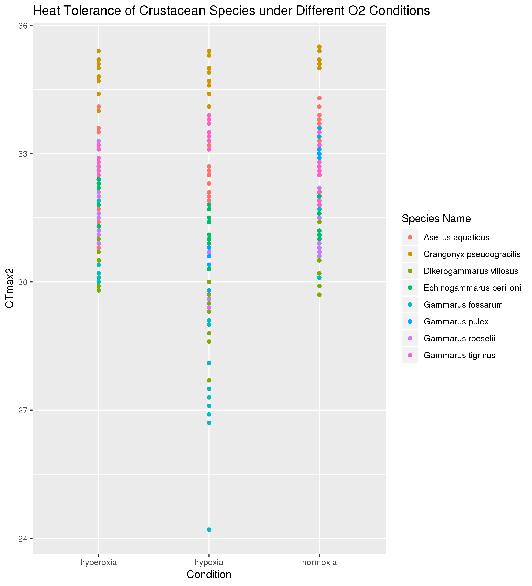
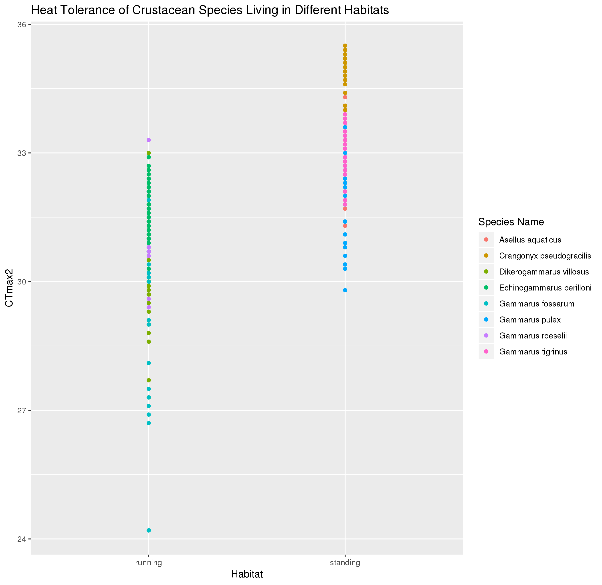

# Data summary by Brian Park

## Overview of data
I used data from https://datadryad.org/resource/doi:10.5061/dryad.tf641/1 which describes differences in heat tolerance for populations of different species of crustacean.

## Q1: Do certain species of crustacean have a higher tolerance to heat than other species?

*Interpreation*: The data show that in general, the crangonyx pseudogracilis has the greatest tolerance to heat (higher CTmax) while the gammarus fossarum species has the least tolerance to heat (smaller CTmax). CT max is the temperature in celsius where the crustacean stopped moving and was used as a measure for heat tolerance. 

## Q2: Does heat tolerance vary with the O2 concentration in the water?

*Interpreation*: The data show that for some species, such as gammarus fossarum, heat tolerance varies more under hypoxia than under hyperoxia or normoxia. The data also shows that larger bodied animals are more susceptible to heat and displayed a lower CTmax while smaller animals were better able to withstand the heat and had a higher CTmax value.  

## Q3: Does the type of habitat a species lives in affect heat tolerance?

*Interpreation*: The data show that species living in standing water have greater heat tolerance than species living in running water. The paper associated with the data set suggests that this is because species in standing waters are subjected to periods of low oxygen more frequently than species in running water and adaptations to these conditions have caused differences in heat tolerance.
